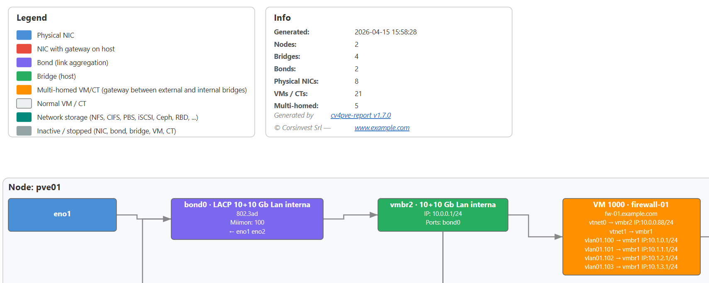

# cv4pve-report

```
     ______                _                      __
    / ____/___  __________(_)___ _   _____  _____/ /_
   / /   / __ \/ ___/ ___/ / __ \ | / / _ \/ ___/ __/
  / /___/ /_/ / /  (__  ) / / / / |/ /  __(__  ) /_
  \____/\____/_/  /____/_/_/ /_/|___/\___/____/\__/

Report Tool for Proxmox VE (Made in Italy)
```

[](LICENSE.md)
[](https://github.com/Corsinvest/cv4pve-report/releases/latest)
[](https://github.com/Corsinvest/cv4pve-report/releases)
[](https://www.nuget.org/packages/Corsinvest.ProxmoxVE.Report/)
[](https://winstall.app/apps/Corsinvest.cv4pve.report)
[](https://aur.archlinux.org/packages/cv4pve-report)

> **The RVTools for Proxmox VE** — exports your entire Proxmox VE infrastructure to a single Excel file plus a network topology diagram (SVG).

**Fully navigable** — every node, VM and storage in the summary tables is a hyperlink to its dedicated detail sheet. Detail sheets have a clickable index to jump to any table inside. One click, no searching.

**Network Diagram** — each export also produces an SVG showing the full network topology per node (physical NICs → bonds → bridges → gateway VMs → internal bridges → leaf VMs) plus a dedicated strip for network-backed storage. Open it in any browser — see the [guide](docs/network-diagram.md) and [sample](docs/network-diagram.svg).

<p align="center">
  <a href="docs/network-diagram.svg"></a>
</p>

---

## Where cv4pve-report fits

RVTools is a pure inventory tool for VMware — it exports infrastructure data to Excel, nothing more. The cv4pve suite follows the Unix philosophy — each tool does one thing and does it well. Use them together for complete coverage.

| | RVTools | [**cv4pve-report**](https://github.com/Corsinvest/cv4pve-report) | [cv4pve-diag](https://github.com/Corsinvest/cv4pve-diag) |
|---|---------|:-----------------:|:-----------:|
| **Platform** | VMware vSphere | Proxmox VE | Proxmox VE |
| **Purpose** | Inventory & reporting | **Inventory & reporting** | **Diagnostics & health checks** |
| **Output** | Excel | Excel + SVG network diagram | Text / HTML / JSON / Markdown / Excel |

### Capabilities

| Feature | RVTools | [cv4pve-report](https://github.com/Corsinvest/cv4pve-report) | [cv4pve-diag](https://github.com/Corsinvest/cv4pve-diag) |
|---------|:-------:|:-------------:|:-----------:|
| VM / CT inventory | ✓ | ✓ | |
| Node / host inventory | ✓ | ✓ | |
| CPU / memory / disk details | ✓ | ✓ | |
| Network inventory (NICs, IPs, MACs) | ✓ | ✓ | |
| [Network topology diagram (SVG)](docs/network-diagram.md) | | ✓ | |
| Storage / datastore inventory | ✓ | ✓ | |
| Snapshot inventory | ✓ | ✓ | |
| Snapshot with RAM state | ✓ | ✓ | |
| Resource pools | ✓ | ✓ | |
| Cluster configuration | ✓ | ✓ | |
| License / subscription inventory | ✓ | ✓ | |
| SSL certificates | | ✓ | |
| RRD metrics (CPU / memory / disk / net) | | ✓ | |
| Guest disk partitions (via agent) | ✓ | ✓ | |
| Guest OS info / hostname (via agent) | | ✓ | |
| SMART data per disk | | ✓ | |
| Backup job configuration | | ✓ | |
| Replication status | | ✓ | |
| HA configuration | | ✓ | |
| Firewall rules | | ✓ | |
| SDN zones / vnets | | ✓ | |
| Users / roles / ACL / TFA / API tokens | | ✓ | |
| APT packages / updates | | ✓ | |
| Syslog (all nodes, parsed into columns) | | ✓ | |
| Cluster log & cluster tasks | | ✓ | |
| Health checks & diagnostics | | | ✓ |

> **cv4pve-report** shows you *what* is in your infrastructure.
> **[cv4pve-diag](https://github.com/Corsinvest/cv4pve-diag)** tells you *what is wrong* with it.

---

## Quick Start

```bash
wget https://github.com/Corsinvest/cv4pve-report/releases/download/VERSION/cv4pve-report-linux-x64.zip
unzip cv4pve-report-linux-x64.zip
./cv4pve-report --host=YOUR_HOST --username=root@pam --password=YOUR_PASSWORD export
```

With API token (recommended):

```bash
./cv4pve-report --host=YOUR_HOST --api-token=user@realm!token=uuid export
```

Each `export` produces **two files** side-by-side:

```
Report_20260415_120000.xlsx   ← full infrastructure inventory
Report_20260415_120000.svg    ← network topology diagram
```

With `--output` / `-o` the same basename is used for both, only the extension differs.

---

## Response Files

Arguments can be stored in a response file and referenced with `@filename`. This is useful to avoid repeating connection parameters on every run.

```text
# config.rsp
--host
192.168.1.1
--api-token
user@pam!report=xxxxxxxx-xxxx-xxxx-xxxx-xxxxxxxxxxxx
```

```bash
cv4pve-report @config.rsp export
cv4pve-report @config.rsp --settings-file=settings.json export
cv4pve-report @config.rsp export --full
```

- One token per line (option name and value on separate lines)
- Lines starting with `#` are comments
- Response files can be nested: a line starting with `@` references another file

---

## Profiles

| Profile | Use case | Speed |
|---------|----------|-------|
| **Fast** | Quick scan, large clusters, CI/CD | fastest |
| **Standard** | Daily reporting, balanced detail | medium |
| **Full** | Audit, compliance, capacity planning | slowest |

```bash
cv4pve-report --host=YOUR_HOST --api-token=user@realm!token=uuid export           # Standard (default)
cv4pve-report --host=YOUR_HOST --api-token=user@realm!token=uuid export --fast    # Fast
cv4pve-report --host=YOUR_HOST --api-token=user@realm!token=uuid export --full    # Full
```

<details>
<summary><strong>Profiles comparison</strong></summary>

| Setting | Fast | Standard | Full |
|---------|:----:|:--------:|:----:|
| **Cluster** | | | |
| IncludeSheet | ✓ | ✓ | ✓ |
| Log.Enabled | | | ✓ |
| Log.MaxCount | | — | 1000 |
| IncludeTasksSheet | ✓ | ✓ | ✓ |
| **Node** | | | |
| Detail.Enabled | | ✓ | ✓ |
| Detail.Disk.IncludeDiskDetail | | ✓ | ✓ |
| Detail.Disk.IncludeSmartData | | | ✓ |
| Detail.IncludeApt | | ✓ | ✓ |
| Detail.Tasks.Enabled | | ✓ | ✓ |
| Detail.IncludeFirewallLog | | ✓ | ✓ |
| IncludeReplicationSheet | ✓ | ✓ | ✓ |
| Syslog.Enabled | | | ✓ |
| Syslog.MaxCount | | — | 1000 |
| Syslog.Since | | — | last 3 days |
| RrdData.Enabled | | ✓ | ✓ |
| RrdData.TimeFrame | | Day | Week |
| **Guest** | | | |
| Detail.Enabled | | ✓ | ✓ |
| Detail.Tasks.Enabled | | ✓ | ✓ |
| Detail.IncludeFirewallLog | | ✓ | ✓ |
| IncludeSnapshotsSheet | | ✓ | ✓ |
| IncludeDisksSheet | | ✓ | ✓ |
| IncludePartitionsSheet | | ✓ | ✓ |
| IncludeQemuAgent | | ✓ | ✓ |
| RrdData.Enabled | | | ✓ |
| RrdData.TimeFrame | | — | Week |
| **Storage** | | | |
| IncludeContentSheet | | ✓ | ✓ |
| IncludeBackupsSheet | | ✓ | ✓ |
| RrdData.Enabled | | ✓ | ✓ |
| RrdData.TimeFrame | | Day | Week |
| **Firewall** | | | |
| Enabled | | ✓ | ✓ |
| MaxCount | | 0 | 1000 |
| Since | | — | last 3 days |

> Fast profile skips all detail sheets, RRD data, firewall and storage content — designed for quick inventory on large clusters.

</details>

---

## Features

- **Single `.xlsx` file** — global sheets plus a dedicated detail sheet per node, VM and container
- **Network topology SVG** — each export produces a `.svg` next to the `.xlsx` showing the physical-to-logical network chain for every node, plus the network-backed storage strip — [guide](docs/network-diagram.md)
- **Fully navigable** — summary rows link to detail sheets; detail sheets have a `← Back` link and a clickable index
- **Cluster** — users, API tokens, TFA, groups, roles, ACL, firewall options, domains, backup jobs, HA, SDN, pools
- **Nodes** — services, network, disks, SMART, ZFS, APT, SSL certificates, replication, syslog, firewall logs, tasks
- **VMs/CTs** — config, network, disks, snapshots, firewall logs, tasks, QEMU agent info
- **Global sheets** — Firewall (rules/aliases/ipsets), RRD Nodes, RRD Storage, RRD Guests, Syslog, Cluster Log, Cluster Tasks, Replication, Network, Disks, Partitions, Snapshots, Storage Content, Backups
- **Flexible filtering** — `@all`, pools, tags, nodes, ID ranges, wildcards, exclusions — [see VM/CT Selection Patterns](#vmct-selection-patterns)
- **Fully customizable** — three built-in profiles (Fast/Standard/Full) or bring your own `settings.json` to control exactly which sheets are generated — [see Settings Reference](#settings-reference)
- **API token** support, cross-platform (Windows, Linux, macOS), no root access required

---

## Installation

| Platform | Command |
|----------|---------|
| **Linux** | `wget .../cv4pve-report-linux-x64.zip && unzip cv4pve-report-linux-x64.zip && chmod +x cv4pve-report` |
| **Windows WinGet** | `winget install Corsinvest.cv4pve.report` |
| **Windows manual** | Download `cv4pve-report-win-x64.zip` from [Releases](https://github.com/Corsinvest/cv4pve-report/releases) |
| **Arch Linux** | `yay -S cv4pve-report` |
| **Debian/Ubuntu** | `sudo dpkg -i cv4pve-report-VERSION-ARCH.deb` |
| **RHEL/Fedora** | `sudo rpm -i cv4pve-report-VERSION-ARCH.rpm` |
| **macOS** | `wget .../cv4pve-report-osx-x64.zip && unzip cv4pve-report-osx-x64.zip && chmod +x cv4pve-report` |

All binaries on the [Releases page](https://github.com/Corsinvest/cv4pve-report/releases).

---

<details>
<summary><strong>Security &amp; Permissions</strong></summary>

### Required Permissions

| Permission | Purpose | Scope |
|------------|---------|-------|
| **VM.Audit** | Read VM/CT configuration and status | Virtual machines |
| **Datastore.Audit** | Read storage content and metrics | Storage systems |
| **Pool.Audit** | Access pool information | Resource pools |
| **Sys.Audit** | Node system information, services, disks | Cluster nodes |
| **Sys.Modify** | APT repositories, available updates and installed package versions | Cluster nodes |


</details>

---

## Report Contents

### Sheet Order

| # | Sheet | Description |
|---|-------|-------------|
| 1 | **Summary** | Report metadata, filters, hyperlinked table of contents |
| 2 | **Cluster** | Cluster-wide configuration and security |
| 3 | **Nodes** | Node overview table → links to node detail sheets |
| 4 | **Vms** | VM overview table → links to VM detail sheets |
| 5 | **Containers** | Container overview table → links to CT detail sheets |
| 6 | **Disks** | Global physical disk inventory across all nodes |
| 7 | **Partitions** | Guest disk partitions via QEMU agent |
| 8 | **Snapshots** | Global snapshot inventory across all VMs/CTs |
| 9 | **Network** | Global network inventory (node interfaces + VM/CT NICs) |
| 10 | **Storages** | Storage overview |
| 11 | **Storage Content** | All storage files/images with size and VM ID links *(if enabled)* |
| 12 | **Backups** | All backup files across all storages *(if enabled)* |
| 13 | **Firewall** | Global firewall rules, aliases and IP sets *(if enabled)* |
| 14 | **Replication** | Global replication job status *(if enabled)* |
| 15 | **RRD Nodes** | Historical metrics for all nodes *(if enabled)* |
| 16 | **RRD Storage** | Historical metrics for all storages *(if enabled)* |
| 17 | **RRD Guests** | Historical metrics for all VMs/CTs *(if enabled)* |
| 18 | **Syslog** | Parsed systemd journal across all nodes *(if enabled)* |
| 19 | **Cluster Log** | Cluster event log *(if enabled)* |
| 20 | **Cluster Tasks** | All recent tasks across the cluster *(if enabled)* |
| … | **Node `<name>`** | Per-node detail sheets (at end) |
| … | **VM `<id>`** | Per-VM detail sheets (at end) |
| … | **CT `<id>`** | Per-CT detail sheets (at end) |


<details>
<summary><strong>Sheet details</strong></summary>

### Cluster Sheet

| Table | Contents |
|-------|----------|
| Status | Nodes, quorum, IP addresses, versions, support level |
| Users | User list with expiry dates |
| API Tokens | Token list with expiry dates |
| Two-Factor Authentication | TFA type per user |
| Groups | Group membership |
| Roles | Role privileges |
| ACL | Access control entries |
| Firewall Options | Global firewall policy |
| Domains | Authentication realms |
| Backup Jobs | Scheduled backup job configuration |
| HA Resources / Groups / Status | High Availability configuration |
| Metric Servers | External metric server configuration |
| SDN Zones / VNets / Controllers | Software-defined networking |
| Hardware Mappings | Directory, PCI and USB mappings |
| Pools | Resource pools with member list |

### Node Detail Sheet

Per-node sheet (linked from Nodes list), with `← Back` to Nodes. Skipped entirely if `Node.Detail.Enabled = false`.

| Table | Contents |
|-------|----------|
| Services | System service status |
| Network | Interface configuration with IPv4/IPv6, bond, VLAN, OVS details |
| /etc/hosts | Host name resolution entries |
| Disks | Physical disk list *(if `Node.Detail.Disk.IncludeDiskDetail`)* |
| SMART Data | SMART attributes per disk *(if `Node.Detail.Disk.IncludeSmartData`)* |
| ZFS Pools / ZFS Pool Status | ZFS pool health, usage, vdev tree *(if `Node.Detail.Disk.IncludeDiskDetail`)* |
| Directory | Filesystem mount points *(if `Node.Detail.Disk.IncludeDiskDetail`)* |
| APT Repository / APT Update / Package Versions | APT info *(if `Node.Detail.IncludeApt`)* |
| Firewall Logs | Node firewall log *(if `Firewall.Enabled`)* |
| SSL Certificates | Certificate validity, expiry, fingerprint |
| Tasks | Recent task history *(if `Node.Detail.Tasks.Enabled`)* |

### VM / CT Detail Sheet

Per-VM/CT sheet (linked from Vms/Containers list), with `← Back` to list. Skipped entirely if `Guest.Detail.Enabled = false`.

| Table | Contents |
|-------|----------|
| Agent OS Info | OS name, kernel, version *(QEMU agent, running VMs only)* |
| Agent Network | Network interfaces from QEMU agent |
| Agent Disks | Filesystems from QEMU agent |
| Network | Interface config from VM config |
| Disks | Disk list with storage, size, cache |
| Firewall Logs | VM/CT firewall log *(if `Firewall.Enabled`)* |
| Tasks | Recent task history *(if `Guest.Detail.Tasks.Enabled`)* |

### Global Sheets

**Network** — one table for node interfaces, one for VM/CT NICs (MAC, bridge, VLAN, IPs, model)

**Disks** — Storage Configuration (cluster-level), Storages (per-node usage), VM Disks (all VM/CT disks)

**Partitions** — guest disk partitions read via QEMU agent (node, VM ID, mount point, filesystem, size, used)

**Snapshots** — all snapshots across all VMs/CTs with RAM flag, size *(if available)*, date

**Firewall** — three tables: Rules, Aliases, IP Sets — each row has ScopeType (cluster/node/qemu/lxc), Scope, ScopeName *(if enabled)*

**Syslog** — one unified table, each row parsed: Node, Date, Time, Host, Service, PID, Message *(if enabled)*

**Cluster Log** — cluster event log with TimeDate, Node, User, Service, Severity, Message *(if enabled)*

**Cluster Tasks** — all recent tasks across the cluster with Node, Type, User, Status, StartTime, Duration *(if enabled)*

**RRD Nodes / RRD Storage / RRD Guests** — single table per sheet with resource identifier columns + time-series metrics *(if enabled)*

</details>

---

## Settings Reference

Customize the report by creating and editing a `settings.json` file:

```bash
# Step 1 — generate a settings file (pick your starting profile)
cv4pve-report create-settings          # Standard (default)
cv4pve-report create-settings --fast   # Fast
cv4pve-report create-settings --full   # Full

# Step 2 — edit settings.json to your needs

# Step 3 — run with your custom settings
cv4pve-report --host=YOUR_HOST --api-token=user@realm!token=uuid export --settings-file=settings.json
```

> **Tip:** setting `Enabled = false` or `Include*Sheet = false` on any section skips that sheet entirely — useful on large clusters to reduce file size and generation time.
>
> Key flags:
> - `Guest.Detail.Enabled = false` — skip all per-VM/CT detail sheets (one sheet per VM)
> - `Node.Detail.Enabled = false` — skip all per-node detail sheets
> - `Cluster.IncludeSheet = false` — skip the Cluster sheet
> - `Guest.IncludeDisksSheet / IncludeSnapshotsSheet / IncludePartitionsSheet = false` — skip individual global sheets
> - `Firewall.Enabled = false` — skip firewall sheet and firewall logs in all detail sheets

<details>
<summary><strong>Full settings.json with all defaults</strong></summary>

```jsonc
{
  "MaxParallelRequests": 5,        // global parallel API requests (1 = sequential)
  "ApiTimeout": 0,                 // HTTP timeout in seconds (0 = 100s)
  "Cluster": {
    "IncludeSheet": true,          // cluster overview sheet (users, roles, ACL, backup jobs)
    "Log": {
      "Enabled": false,            // cluster event log sheet
      "MaxCount": 0                // 0 = unlimited
    },
    "IncludeTasksSheet": true      // cluster tasks sheet
  },
  "Node": {
    "Names": "@all",               // @all | pve1 | pve1,pve2 | pve*
    "Detail": {
      "Enabled": true,             // per-node detail sheets (set false to skip all, useful on large clusters)
      "Disk": {
        "IncludeDiskDetail": true, // physical disks, ZFS, directory mount points
        "IncludeSmartData": false  // SMART attributes per disk (one API call per disk — slow)
      },
      "Tasks": {
        "Enabled": true,
        "OnlyErrors": false,       // show only failed tasks
        "MaxCount": 0,             // 0 = unlimited
        "Source": "all"            // all | local | active
      },
      "IncludeApt": true,          // APT repositories, available updates, installed packages
      "IncludeFirewallLog": true   // firewall log in node detail sheet (requires Firewall.Enabled)
    },
    "RrdData": {
      "Enabled": true,
      "TimeFrame": "Day",          // Hour | Day | Week | Month | Year
      "Consolidation": "Average"   // Average | Maximum
    },
    "IncludeReplicationSheet": true, // replication jobs global sheet
    "Syslog": {
      "Enabled": false,
      "MaxCount": 500,
      "Since": null,               // DateOnly e.g. "2024-01-01"
      "Until": null
    }
  },
  "Guest": {
    "Ids": "@all",                 // see VM/CT Selection Patterns below
    "Detail": {
      "Enabled": true,             // per-VM/CT detail sheets (set false to skip all, useful on large clusters)
      "Tasks": {
        "Enabled": true,
        "OnlyErrors": false,
        "MaxCount": 0,
        "Source": "all"
      },
      "IncludeFirewallLog": true   // firewall log in VM/CT detail sheet (requires Firewall.Enabled)
    },
    "RrdData": {
      "Enabled": false,            // disabled by default — can be large on big clusters
      "TimeFrame": "Day",
      "Consolidation": "Average"
    },
    "IncludeSnapshotsSheet": true, // global snapshots sheet
    "IncludeDisksSheet": true,     // global disks sheet
    "IncludePartitionsSheet": true, // guest disk partitions via QEMU agent
    "IncludeQemuAgent": true,      // OS info, network, filesystems (running VMs with agent only)
    "QemuAgentTimeout": 3          // seconds to wait for QEMU agent response before giving up
  },
  "Storage": {
    "IncludeContentSheet": true,   // storage content (ISO, templates, disk images)
    "IncludeBackupsSheet": true,   // backup files
    "RrdData": {
      "Enabled": true,
      "TimeFrame": "Day",
      "Consolidation": "Average"
    }
  },
  "Firewall": {
    "Enabled": true,               // global firewall sheet + firewall logs in detail sheets
    "MaxCount": 0,                 // 0 = unlimited firewall log lines
    "Since": null,                 // DateOnly e.g. "2024-01-01"
    "Until": null
  }
}
```

</details>

---

## Performance Tuning

By default the report runs up to **5 parallel API requests** (`MaxParallelRequests = 5`). This works well for most clusters, but you can tune it to match your environment.

### Speed up the report

Increase `MaxParallelRequests` to fetch more data at the same time:

```jsonc
"MaxParallelRequests": 10
```

> **Don't go too high.** Each parallel request is a real HTTP call to Proxmox. Too many at once can slow down the API, increase memory usage on both sides, and make the report less stable. Values between 5 and 15 are a reasonable range.

### Handle slow or high-latency clusters

Parallelism means more simultaneous requests — if your cluster is slow or the network has high latency, some calls may time out. Increase `ApiTimeout` to give them more time:

```jsonc
"ApiTimeout": 300   // seconds (0 = 100s)
```

### Speed up QEMU agent calls

Each running VM with the QEMU agent enabled requires an agent call to collect OS info, network interfaces and disk partitions. If the agent is slow to respond, the report waits up to `QemuAgentTimeout` seconds per VM before giving up:

```jsonc
"QemuAgentTimeout": 3   // default: 3 seconds
```

Lower this value if you have many VMs and the agent is unreliable. Set it to `1` for a quick scan, or raise it if agents are consistently slow.

### Debug API calls

Add `--debug` to see every API call with its duration in milliseconds — useful to identify which calls are slow:

```bash
cv4pve-report @config.rsp export --debug
```

### Summary

| Setting | Effect | Default |
|---------|--------|---------|
| `MaxParallelRequests` ↑ | Faster, but more load on Proxmox and higher memory usage | 5 |
| `ApiTimeout` ↑ | Avoids timeouts on slow/high-latency clusters | 100s |
| `QemuAgentTimeout` ↓ | Less waiting per VM when agent is slow or absent | 3s |

---

## VM/CT Selection Patterns

The `Guest.Ids` setting supports the same powerful pattern matching as [cv4pve-autosnap](https://github.com/Corsinvest/cv4pve-autosnap):

| Pattern | Syntax | Description | Example |
|---------|--------|-------------|---------|
| **All VMs** | `@all` | All VMs/CTs in cluster | `@all` |
| **Single ID** | `ID` | Specific VM/CT by ID | `100` |
| **Single Name** | `name` | Specific VM/CT by name | `web-server` |
| **Multiple** | `ID,ID,ID` | Comma-separated list | `100,101,102` |
| **ID Range** | `start:end` | Range of IDs (inclusive) | `100:110` |
| **Wildcard** | `%pattern%` | Name contains pattern | `%web%` |
| **By Node** | `@node-name` | All VMs on specific node | `@node-pve1` |
| **By Pool** | `@pool-name` | All VMs in pool | `@pool-production` |
| **By Tag** | `@tag-name` | All VMs with tag | `@tag-backup` |
| **Exclusion** | `-ID` or `-name` | Exclude specific VM | `@all,-100` |
| **Tag Exclusion** | `-@tag-name` | Exclude by tag | `@all,-@tag-test` |
| **Node Exclusion** | `-@node-name` | Exclude by node | `@all,-@node-pve2` |

```
@all                          # all VMs/CTs
100,101,102                   # specific IDs
100:200                       # IDs from 100 to 200
@pool-production              # all VMs in pool "production"
@tag-backup                   # all VMs tagged "backup"
@node-pve1                    # all VMs on node pve1
@all,-100,-101                # all except VM 100 and 101
@all,-@tag-test               # all except VMs tagged "test"
%web%                         # VMs whose name contains "web"
```

---

## Support

Professional support and consulting available through [Corsinvest](https://www.corsinvest.it/cv4pve).

---

Part of [cv4pve](https://www.corsinvest.it/cv4pve) suite | Made with ❤️ in Italy by [Corsinvest](https://www.corsinvest.it)

Copyright © Corsinvest Srl
